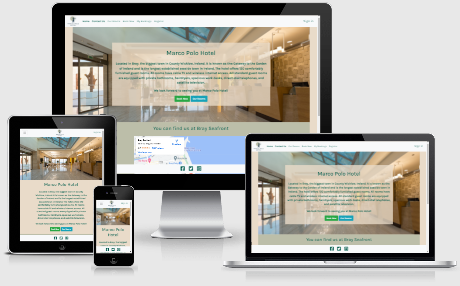
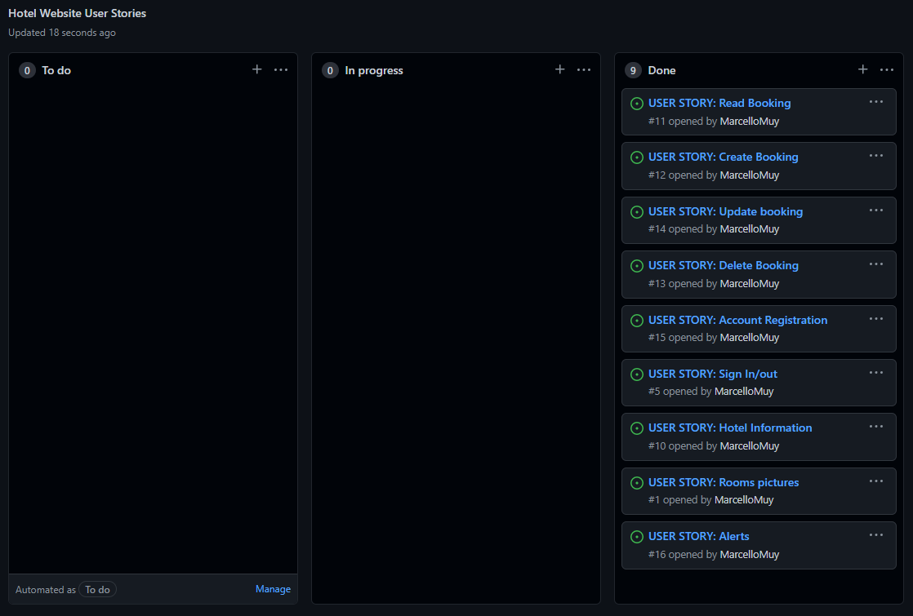
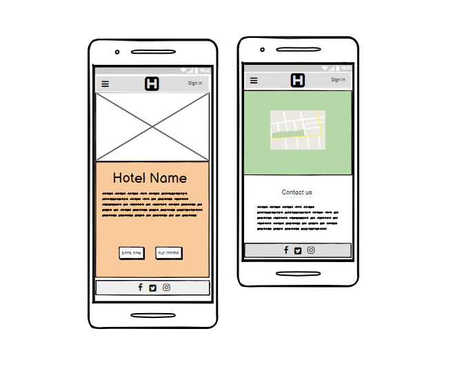
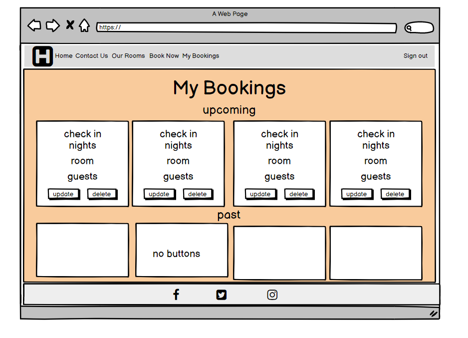

# Hotel Booking System with Django

## Introduction

Welcome to my fourth milestone project. In this project, I create a hotel booking system where users can register an account, book a room, and manage their bookings.  
It will use the Django framework, Python, HTML, and JavaScript languages.

This project aims to show the use of CRUD functionality (Create, Read, Update, Delete). After registering an account, the user can create, read, update and delete their hotel booking.

A live website can be found [here](https://my-hotel-project.herokuapp.com/).



## Table of Contents

- [1 UX](#ux)
  - [1.1 Strategy](#strategy)
    - [Project Goals](#project-goals)
    - [User Goals](#user-goals)
    - [User Expectations](#user-expectations)
    - [User Stories](#user-stories)
    - [Scope](#scope)
      - [Phase 1](#phase-1)
      - [Phase 2](#phase-2)
  - [1.2 Structure](#structure)
    - [Data Model](#data-model)
  - [1.3 Wire-frames](#wire-frames)
    - [Mobile](#mobile)
    - [Desktop](#desktop)
  - [1.4 Surface](#surface)
    - [Colours](#colours)
    - [Typography](#typography)
- [2 Features](#features)
- [3 Technologies Used](#technologies-used)
- [4 Testing](#testing)
- [5 Development Cycle](#development-cycle)
- [6 Deployment](#deployment)
- [7 End Product](#end-product)
- [8 Known Bugs](#known-bugs)
- [9 Credits](#credits)

## 1 UX

[Go to the top](#table-of-contents)

Traveling is by far the thing that I like to do most, and a big part of the trip is about where you are staying.
When you visit a new city, you need a place to stay. The easiest way to book a hotel room is online.

This project will demonstrate how simple and easy to use a hotel booking system can be.

## 1.1 Strategy

[Go to the top](#table-of-contents)

### Project Goals

This project aims to allow users to register a new account, perform a sign-in and sign-out action, book a hotel room, and manage their bookings (see past and future bookings, make an update on an upcoming booking, or cancel the booking).

### User Goals

First Time Visitor Goals

- As a first-time visitor, I want to book a room for a chosen date.
- As a first-time visitor, I want to view pictures of the hotel room and prices per night.
- As a first-time visitor, I want to view information about the hotel so I can decide to book a room.
- As a first-time visitor, I want to get the hotel's contact information.

Returning Visitor Goals

- As a Returning Visitor, I want to view my bookings details.
- As a Returning Visitor, I want to update an upcoming booking.
- As a Returning Visitor, I want to cancel an upcoming booking.

Frequent User Goals

- As a Frequent User, I want to see my past bookings or book a new stay.

### User Expectations

 The following user expections were considered while designing the site:

- The menu is clear to read and navigate.
- The site structure is designed to be simple and easy to use.
- The user interface is easy to navigate.
- The website is responsive on all devices.
- All images on the website are of high quality.
- Easy to find contact information and hotel location.

### User Stories

I use GitHub kanban board to log all user stories for my project. It was an excellent tool to visualize what to focus on first.
The user stories would go directly to the "To Do" lane when created. I would move them to the "In progress" lane when working on the story, and once completed, I would move them to the "Done" lane.



### Scope

I decided to divide this project into two phases. I include the features that I have identified as a minimum viable product in the first phase.
In the second, I included the features that I found would make a good improvement for the web application.

### Phase 1

- Display rooms pictures
- Display hotel information, including location and contact
- Allow users to register a new account
- Responsive design
- Ability to create a booking
- Ability to update a booking
- Ability to cancel a booking
- Display past bookings
- Display alerts for each step of CRUD operations

### Phase 2

- Register account email confirmation
- Email confirmation for new bookings
- Create a new Django view to confirm booking deletion instead of using a JavaScript function
- Calculate the total of the booking and display it to the user

## 1.2 Structure

[Go to the top](#table-of-contents)

- All pages of this project are responsive using different screen sizes. In addition, fonts and color scheme are consistent throughout all pages, guaranteeing the best user experience.
- Navbar is positioned at the top, and Footer at the bottom of all pages.
- Buttons have self-describing text for easy navigation.

### Data Model

- Planned database structure:


- Final database structure:

```python
class Booking(models.Model):
    ''' Model for user bookings '''
    today = date.today()
    user = models.ForeignKey(
        User, on_delete=models.CASCADE, related_name="user_bookings")
    created_on = models.DateTimeField(auto_now_add=True)
    number_of_guests = models.PositiveIntegerField(
        default=1, validators=[MaxValueValidator(15), MinValueValidator(1)])
    check_in_date = models.DateField(default=date.today)
    number_of_nights = models.PositiveIntegerField(
        default=1, validators=[MaxValueValidator(30), MinValueValidator(1)])
    TYPE_OF_ROOM_CHOICES = [
        ('Twin', 'Twin Room'),
        ('Double', 'Double Room'),
        ('Family', 'Family Room'),
    ]
    type_of_room = models.CharField(
        max_length=15,
        choices=TYPE_OF_ROOM_CHOICES,
        blank=False,
        default='Double'
        )

    ''' Display objects using the check-in date'''
    def __str__(self):
        return str(self.check_in_date)

    class Meta:
        """ Meta class used for organizing bookings by check-in date """
        ordering = ['check_in_date']
```

## 1.3 Wire-frames

[Go to the top](#table-of-contents)

### Mobile

Home Page mobile:



Our Rooms Page mobile:


My bookings Page mobile:


Book Now Page mobile:


Sign in/out and Register Page mobile:


### Desktop

[Go to the top](#table-of-contents)

Only the index page and my bookings page have a difference in design compared to the mobile version.

Index Page desktop top:

The index page has a bigger hero image covering most of the page, a margin on both sides of the page, and the hotel info is displayed on top of the hero image.


Index Page desktop bottom:


My Bookings Page desktop:

My bookings page displays booking cards in rows of up to four cards.



## 1.4 Surface

[Go to the top](#table-of-contents)

### Colours

I used ColorSpace to generate this colour scheme.


Colours used:
 #E9DBC9
 #005B4B
 #e9dbc9c9
 #BCBEA9
 #f8f9fa

### Typography

I decided to use "Karla" for all pages with "Sans Serif" as the backup font.

Google fonts link [here](https://fonts.google.com/specimen/Karla?query=karla)


## Installed frameworks and libraries

- Django 3.2 (framework)
- Gunicorn (to run server on heroku)

- Dj_database_url (library)
- Psycopg2 (library to connect to PostgreSQL)
- Cloudinary (library to host pictures on Heroku)
- django-allauth (library used for authentication and registration)
- django-crispy-forms (library used to format forms)
- whitenoise (Allows web app to serve its own static files)
